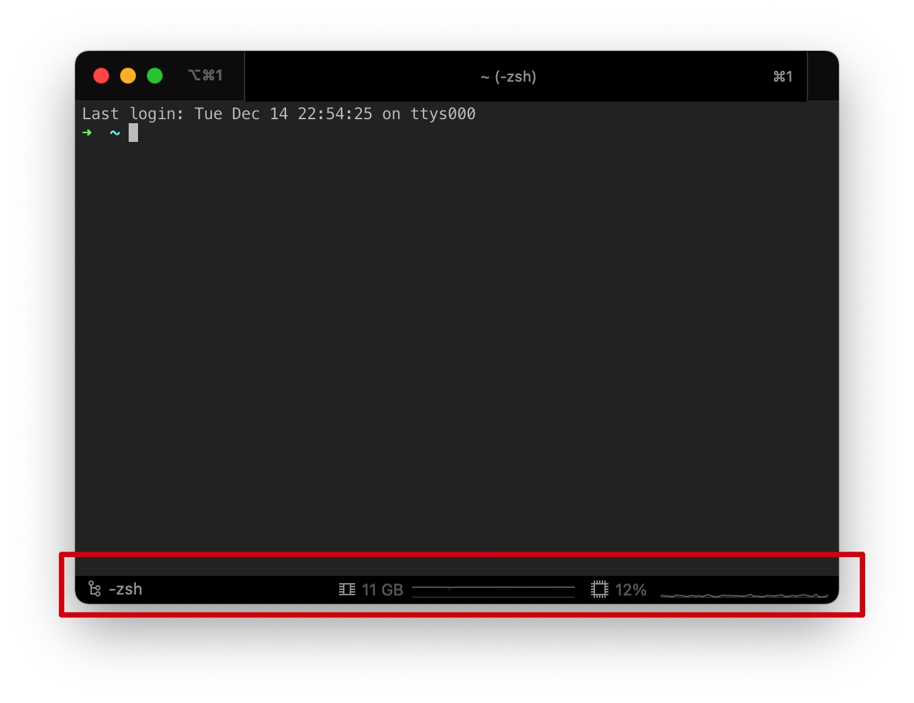
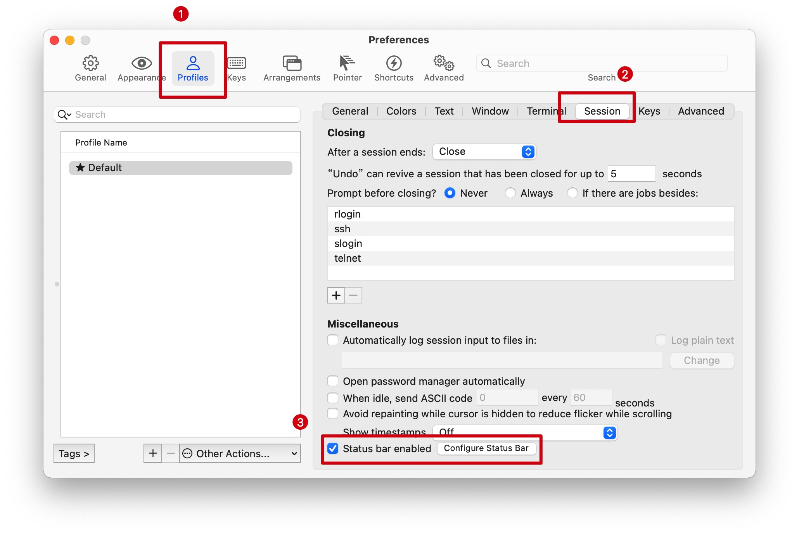
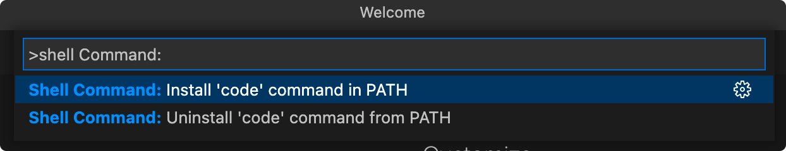

# 终端设置

## Oh My Zsh

官网网址：[https://ohmyz.sh/](https://ohmyz.sh/)


## iTerm2的配置使用

用于代替macOS的终端软件

安装网址：[iTerm2](https://iterm2.com/)

### status bar

status bar就是一下图示的红色区域：



如果需要使用呢，请按照以下的图示开启status bar：




## 在命令行打开VSCode

首先打开VSCode，然后使用快捷键Shift+Command+P，调起命令窗口，输入shell Command，下方出现Install 'code' command in PATH选项，点击以安装。



使用

打开命令行，进入工作目录，然后如果要用vscode打开某个文件夹，直接输入vscode + . 即可。


## link

软链接的作用就是生成一个目标文件或者目录，这个文件或者目录指向源文件或者目录。

语法

```
ln -s [源文件或目录] [目标文件或目录]
```

在某个场景下，我想通过终端，使用VSCode打开某个文件夹，步骤是如下：

1. 打开终端
2. 一层一层进入到对应的文件夹内。
3. 使用code + .命令打开文件夹。

如果文件夹所在的层次较多，又无法移动，我们可以使用link命令，通过软链接的方式，将该文件夹软链接到用户的根目录下。

执行的软连接的命令如下：

```
ln -s /Volumes/Backup/fk ~/
```

这样就会在当前的用户目录下创建一个`fk`的文件夹，这个文件夹会指向`/Volumes/Backup/fk`，之后我只需要在终端直接`cd ~/fk`，即可执行code命令打开文件夹。


